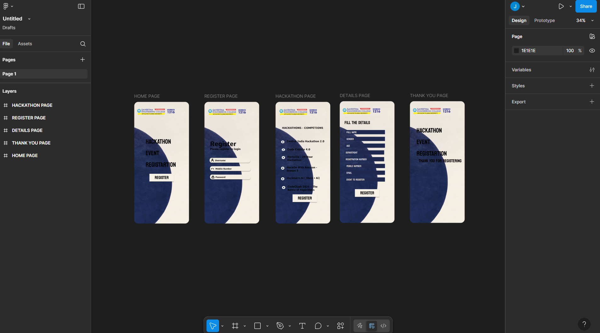

# Ex09 Event Registration Web Application
## Date: 16-05-2025

## AIM:
To design, develop and deploy a web application for event registration.

## DESIGN STEPS:

### Step 1:
Create a new frame.

### Step 2:
Select any one preset size of your choice.

### Step 3:
Select the shapes you need.

### Step 4:
Import images as needed.

### Step 5:
Create pages based on your need and link them.

### Step 6:

Validate the HTML and CSS code.

### Step 6:

Publish the website in the given URL.

## DESIGN TOOL:
Figma

## CODE:
HOME PAGE 
```
<div style="width: 100%; height: 100%; position: relative; background: white; overflow: hidden; border-radius: 30px">
    
    
    <div style="width: 260px; height: 244px; left: 86px; top: 256px; position: absolute; color: black; font-size: 48px; font-family: Koulen; font-weight: 400; word-wrap: break-word">HACKATHON EVENT REGISTARTION </div>
    <div style="width: 183.70px; height: 58px; left: 114px; top: 542px; position: absolute; background: #F7F0E6; box-shadow: 0px 4px 4px rgba(0, 0, 0, 0.25)"></div>
    <div style="width: 164.80px; height: 38.11px; left: 124px; top: 542px; position: absolute; text-align: center; color: black; font-size: 32px; font-family: Koulen; font-weight: 400; word-wrap: break-word">REGISTER</div>
</div>

// HACKATHON EVENT REGISTARTION 
color: black;
 font-size: 48px;
 font-family: Koulen;
 font-weight: 400;
 word-wrap: break-word
---
// REGISTER
color: black;
 font-size: 32px;
 font-family: Koulen;
 font-weight: 400;
 word-wrap: break-word
```

REGISER PAGE
```
<div style="width: 100%; height: 100%; position: relative; background: white; overflow: hidden; border-radius: 30px">
    
    
    
    <div style="width: 336.49px; height: 17.57px; left: 42px; top: 343px; position: absolute; color: black; font-size: 20px; font-family: Comme; font-weight: 700; word-wrap: break-word">Please register to login</div>
    <div style="width: 261px; height: 75px; left: 42px; top: 287px; position: absolute; color: black; font-size: 48px; font-family: Comme; font-weight: 700; word-wrap: break-word">Register</div>
    <div style="width: 306px; height: 36px; left: 42px; top: 548px; position: absolute; background: #F3EDE1; box-shadow: 0px 4px 4px rgba(0, 0, 0, 0.25); border-radius: 15px"></div>
    <div style="width: 88px; height: 16px; left: 83px; top: 558px; position: absolute; color: black; font-size: 16px; font-family: Comme; font-weight: 700; word-wrap: break-word">Password</div>
    <div data-size="48" style="width: 22px; height: 21px; left: 53px; top: 556px; position: absolute; overflow: hidden">
        <div style="width: 16.50px; height: 17.50px; left: 2.75px; top: 1.75px; position: absolute; outline: 4px var(--Icon-Default-Default, #1E1E1E) solid; outline-offset: -2px"></div>
    </div>
    <div style="width: 306px; height: 36px; left: 39px; top: 422px; position: absolute; background: #F3EDE1; box-shadow: 0px 4px 4px rgba(0, 0, 0, 0.25); border-radius: 15px"></div>
    <div style="width: 88px; height: 16px; left: 80px; top: 432px; position: absolute; color: black; font-size: 16px; font-family: Comme; font-weight: 700; word-wrap: break-word">Username</div>
    <div data-size="48" style="width: 24px; height: 24px; left: 48px; top: 427px; position: absolute; overflow: hidden">
        <div style="width: 16px; height: 18px; left: 4px; top: 3px; position: absolute; outline: 4px var(--Icon-Default-Default, #1E1E1E) solid; outline-offset: -2px"></div>
    </div>
    <div style="width: 16px; height: 18px; left: 52px; top: 430px; position: absolute; outline: 4px var(--Icon-Default-Default, #1E1E1E) solid; outline-offset: -2px"></div>
    <div style="width: 306px; height: 36px; left: 42px; top: 485px; position: absolute; background: #F3EDE1; box-shadow: 0px 4px 4px rgba(0, 0, 0, 0.25); border-radius: 15px"></div>
    <div style="width: 24px; height: 24px; left: 48px; top: 492px; position: absolute">
        <div style="width: 22.40px; height: 8.70px; left: 0.80px; top: 8px; position: absolute; background: var(--Schemes-On-Surface, #1D1B20)"></div>
    </div>
    <div style="width: 131px; height: 18px; left: 83px; top: 495px; position: absolute; color: black; font-size: 16px; font-family: Comme; font-weight: 700; word-wrap: break-word">Mobile Number</div>
</div>

// Please register to login
color: black;
 font-size: 20px;
 font-family: Comme;
 font-weight: 700;
 word-wrap: break-word
---
// Register
color: black;
 font-size: 48px;
 font-family: Comme;
 font-weight: 700;
 word-wrap: break-word
---
// Password
color: black;
 font-size: 16px;
 font-family: Comme;
 font-weight: 700;
 word-wrap: break-word
---
// Username
color: black;
 font-size: 16px;
 font-family: Comme;
 font-weight: 700;
 word-wrap: break-word
---
// Mobile Number
color: black;
 font-size: 16px;
 font-family: Comme;
 font-weight: 700;
 word-wrap: break-word
```

HACKATHON PAGE
```
<div style="width: 100%; height: 100%; position: relative; background: white; overflow: hidden; border-radius: 30px">
    
    
    
    <div style="width: 313px; height: 27px; left: 49px; top: 184px; position: absolute; color: black; font-size: 20px; font-family: Comme; font-weight: 700; word-wrap: break-word">HACKATHONS - COMPETIONS</div>
    <div style="width: 284.64px; height: 50px; left: 90px; top: 627px; position: absolute; color: black; font-size: 20px; font-family: Comme; font-weight: 700; word-wrap: break-word">CodeClash 2025 – The Battle of Algorithms</div>
    <div style="width: 29.57px; height: 26.67px; left: 46px; top: 632.44px; position: absolute">
        <div style="width: 24.64px; height: 22.22px; left: 2.46px; top: 2.22px; position: absolute; background: white"></div>
    </div>
    <div style="width: 284.64px; height: 50px; left: 83.36px; top: 562px; position: absolute; color: black; font-size: 20px; font-family: Comme; font-weight: 700; word-wrap: break-word">Hackmern.Ai ( Mern + Ai)</div>
    <div style="width: 29.57px; height: 26.67px; left: 39px; top: 566.44px; position: absolute">
        <div style="width: 24.64px; height: 22.22px; left: 2.46px; top: 2.22px; position: absolute; background: white"></div>
    </div>
    <div style="width: 284.64px; height: 50px; left: 88.36px; top: 402px; position: absolute; color: black; font-size: 20px; font-family: Comme; font-weight: 700; word-wrap: break-word">Hackzilla - 24 Hour Hackathon</div>
    <div style="width: 29.57px; height: 26.67px; left: 44px; top: 406.44px; position: absolute">
        <div style="width: 24.64px; height: 22.22px; left: 2.46px; top: 2.22px; position: absolute; background: white"></div>
    </div>
    <div style="width: 284.64px; height: 50px; left: 83.36px; top: 482px; position: absolute; color: black; font-size: 20px; font-family: Comme; font-weight: 700; word-wrap: break-word">HackOn With Amazon - Season 5</div>
    <div style="width: 29.57px; height: 26.67px; left: 39px; top: 486.44px; position: absolute">
        <div style="width: 24.64px; height: 22.22px; left: 2.46px; top: 2.22px; position: absolute; background: white"></div>
    </div>
    <div style="width: 286.37px; height: 41px; left: 88.63px; top: 346px; position: absolute; color: black; font-size: 20px; font-family: Comme; font-weight: 700; word-wrap: break-word">Code Cubicle 4.0</div>
    <div style="width: 29.75px; height: 21.87px; left: 44px; top: 349.64px; position: absolute">
        <div style="width: 24.79px; height: 18.22px; left: 2.48px; top: 1.82px; position: absolute; background: white"></div>
    </div>
    <div style="width: 288.97px; height: 47px; left: 84.03px; top: 285px; position: absolute; color: black; font-size: 20px; font-family: Comme; font-weight: 700; word-wrap: break-word">Central India Hackathon 2.0</div>
    <div style="width: 30.02px; height: 25.07px; left: 39px; top: 289.18px; position: absolute">
        <div style="width: 25.02px; height: 20.89px; left: 2.50px; top: 2.09px; position: absolute; background: white"></div>
    </div>
    <div style="width: 183.70px; height: 58px; left: 128px; top: 697px; position: absolute; background: #F7F0E6; box-shadow: 0px 4px 4px rgba(0, 0, 0, 0.25)"></div>
    <div style="width: 164.80px; height: 38.11px; left: 138px; top: 697px; position: absolute; text-align: center; color: black; font-size: 32px; font-family: Koulen; font-weight: 400; word-wrap: break-word">REGISTER</div>
</div>

// HACKATHONS - COMPETIONS
color: black;
 font-size: 20px;
 font-family: Comme;
 font-weight: 700;
 word-wrap: break-word
---
// CodeClash 2025 – The Battle of Algorithms
color: black;
 font-size: 20px;
 font-family: Comme;
 font-weight: 700;
 word-wrap: break-word
---
// Hackmern.Ai ( Mern + Ai)
color: black;
 font-size: 20px;
 font-family: Comme;
 font-weight: 700;
 word-wrap: break-word
---
// Hackzilla - 24 Hour Hackathon
color: black;
 font-size: 20px;
 font-family: Comme;
 font-weight: 700;
 word-wrap: break-word
---
// HackOn With Amazon - Season 5
color: black;
 font-size: 20px;
 font-family: Comme;
 font-weight: 700;
 word-wrap: break-word
---
// Code Cubicle 4.0
color: black;
 font-size: 20px;
 font-family: Comme;
 font-weight: 700;
 word-wrap: break-word
---
// Central India Hackathon 2.0
color: black;
 font-size: 20px;
 font-family: Comme;
 font-weight: 700;
 word-wrap: break-word
---
// REGISTER
color: black;
 font-size: 32px;
 font-family: Koulen;
 font-weight: 400;
 word-wrap: break-word
```

DETAILS PAGE
```
<div style="width: 100%; height: 100%; position: relative; background: white; overflow: hidden; border-radius: 30px">
    
    
    <div style="width: 298px; height: 32px; left: 42px; top: 217px; position: absolute; background: #202950"></div>
    <div style="width: 230px; height: 32px; left: 51px; top: 217px; position: absolute; color: #EBE4DC; font-size: 20px; font-family: Koulen; font-weight: 400; word-wrap: break-word">Full NAME </div>
    <div style="width: 298px; height: 32px; left: 42px; top: 268px; position: absolute; background: #202950"></div>
    <div style="width: 230px; height: 32px; left: 51px; top: 268px; position: absolute; color: #EBE4DC; font-size: 20px; font-family: Koulen; font-weight: 400; word-wrap: break-word">GENDER </div>
    <div style="width: 298px; height: 32px; left: 42px; top: 319px; position: absolute; background: #202950"></div>
    <div style="width: 230px; height: 32px; left: 51px; top: 319px; position: absolute; color: #EBE4DC; font-size: 20px; font-family: Koulen; font-weight: 400; word-wrap: break-word">AGE </div>
    <div style="width: 298px; height: 32px; left: 36px; top: 370px; position: absolute; background: #202950"></div>
    <div style="width: 230px; height: 32px; left: 45px; top: 370px; position: absolute; color: #EBE4DC; font-size: 20px; font-family: Koulen; font-weight: 400; word-wrap: break-word">DEPARTMENT</div>
    <div style="width: 298px; height: 32px; left: 36px; top: 421px; position: absolute; background: #202950"></div>
    <div style="width: 230px; height: 32px; left: 45px; top: 421px; position: absolute; color: #EBE4DC; font-size: 20px; font-family: Koulen; font-weight: 400; word-wrap: break-word">REGISTRATION NUMBER<br/></div>
    <div style="width: 298px; height: 32px; left: 42px; top: 472px; position: absolute; background: #202950"></div>
    <div style="width: 230px; height: 32px; left: 51px; top: 472px; position: absolute; color: #EBE4DC; font-size: 20px; font-family: Koulen; font-weight: 400; word-wrap: break-word">MOBILE NUMBER</div>
    <div style="width: 298px; height: 32px; left: 42px; top: 523px; position: absolute; background: #202950"></div>
    <div style="width: 230px; height: 32px; left: 51px; top: 523px; position: absolute; color: #EBE4DC; font-size: 20px; font-family: Koulen; font-weight: 400; word-wrap: break-word">EMAIL</div>
    <div style="width: 183.70px; height: 58px; left: 114px; top: 663px; position: absolute; background: #F7F0E6; box-shadow: 0px 4px 4px rgba(0, 0, 0, 0.25)"></div>
    <div style="width: 164.80px; height: 38.11px; left: 124px; top: 663px; position: absolute; text-align: center; color: black; font-size: 32px; font-family: Koulen; font-weight: 400; word-wrap: break-word">REGISTER</div>
    <div style="width: 298px; height: 32px; left: 42px; top: 574px; position: absolute; background: #202950"></div>
    <div style="width: 230px; height: 32px; left: 51px; top: 574px; position: absolute; color: #EBE4DC; font-size: 20px; font-family: Koulen; font-weight: 400; word-wrap: break-word">EVENT TO REGISTER</div>
    <div style="width: 255px; height: 39px; left: 36px; top: 133px; position: absolute; color: black; font-size: 32px; font-family: Koulen; font-weight: 400; word-wrap: break-word">Fill The details</div>
</div>

// Full NAME 
color: #EBE4DC;
 font-size: 20px;
 font-family: Koulen;
 font-weight: 400;
 word-wrap: break-word
---
// GENDER 
color: #EBE4DC;
 font-size: 20px;
 font-family: Koulen;
 font-weight: 400;
 word-wrap: break-word
---
// AGE 
color: #EBE4DC;
 font-size: 20px;
 font-family: Koulen;
 font-weight: 400;
 word-wrap: break-word
---
// DEPARTMENT
color: #EBE4DC;
 font-size: 20px;
 font-family: Koulen;
 font-weight: 400;
 word-wrap: break-word
---
// REGISTRATION NUMBER<br/>
color: #EBE4DC;
 font-size: 20px;
 font-family: Koulen;
 font-weight: 400;
 word-wrap: break-word
---
// MOBILE NUMBER
color: #EBE4DC;
 font-size: 20px;
 font-family: Koulen;
 font-weight: 400;
 word-wrap: break-word
---
// EMAIL
color: #EBE4DC;
 font-size: 20px;
 font-family: Koulen;
 font-weight: 400;
 word-wrap: break-word
---
// REGISTER
color: black;
 font-size: 32px;
 font-family: Koulen;
 font-weight: 400;
 word-wrap: break-word
---
// EVENT TO REGISTER
color: #EBE4DC;
 font-size: 20px;
 font-family: Koulen;
 font-weight: 400;
 word-wrap: break-word
---
// Fill The details
color: black;
 font-size: 32px;
 font-family: Koulen;
 font-weight: 400;
 word-wrap: break-word
```
THANK YOU PAGE
```
<div style="width: 100%; height: 100%; position: relative; background: white; overflow: hidden; border-radius: 30px">
    
    
    <div style="width: 260px; height: 244px; left: 50px; top: 177px; position: absolute; color: black; font-size: 48px; font-family: Koulen; font-weight: 400; word-wrap: break-word">HACKATHON EVENT REGISTARTION </div>
    <div style="width: 350px; height: 151px; left: 66px; top: 421px; position: absolute; color: #050000; font-size: 32px; font-family: Koulen; font-weight: 400; word-wrap: break-word">THANK YOU FOR REGISTERING </div>
</div>

// HACKATHON EVENT REGISTARTION 
color: black;
 font-size: 48px;
 font-family: Koulen;
 font-weight: 400;
 word-wrap: break-word
---
// THANK YOU FOR REGISTERING 
color: #050000;
 font-size: 32px;
 font-family: Koulen;
 font-weight: 400;
 word-wrap: break-word
```

## OUTPUT:



## RESULT:
The program to design, develop and deploy a web application for event registration is completed successfully.
